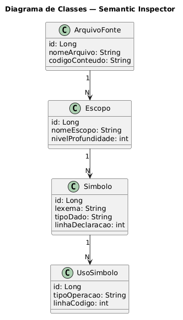
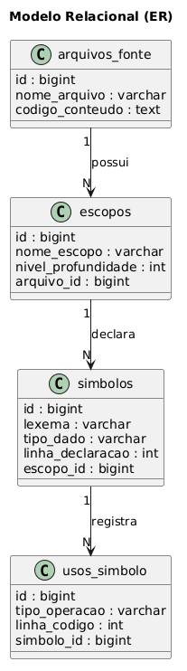
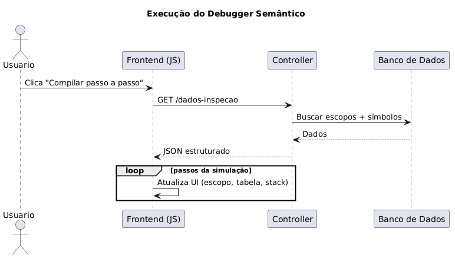

# ⚙️ Semantic Inspector — Inspecionador Web de Tabela de Símbolos

## 📖 Descrição

O **Semantic Inspector** é uma ferramenta web educacional (DevTool) projetada para auxiliar estudantes e desenvolvedores a **visualizar e compreender a Análise Semântica** no contexto de construção de compiladores.

A aplicação permite o cadastro de códigos-fonte e a modelagem interativa da:

- 🌳 Árvore de escopos léxicos  
- 📋 Tabela de símbolos  
- 📦 Pilha de ativação (stack frames)  

Seu principal diferencial é um **Visual Debugger interativo**, que simula a execução semântica **passo a passo**, demonstrando na prática:

- Ciclo de vida de variáveis  
- Escopo léxico  
- Shadowing (sombreamento de variáveis)  
- Leitura e escrita de símbolos  

---

## 🎓 Contexto Acadêmico

Projeto desenvolvido como parte do:

Trabalho Incremental de Software (TIS)  
Disciplina: Desenvolvimento Full Stack  
Universidade Federal de Goiás (UFG) — Instituto de Informática  

---

## ✨ Funcionalidades

- CRUD de códigos-fonte  
- Mapeamento de escopos  
- Tabela de símbolos interativa  
- Simulação passo a passo  
- Visualização da pilha de ativação  
- Rastreamento de leitura/escrita  

---

## 📊 Diagramas do Sistema

### 🧩 Diagrama de Classes


### 🗄️ Modelo ER


### 🔄 Diagrama de Sequência


---

## 🛠️ Stack Tecnológico

Backend:
- Java 17+
- Spring Boot
- JPA / Hibernate

Frontend:
- HTML, CSS
- JavaScript (Vanilla)
- Thymeleaf

Banco:
- PostgreSQL
- H2

---

## 🚀 Como Executar

### Pré-requisitos
- Java 17+
- PostgreSQL rodando
- Banco: db_springboot

### Passos

```bash
git clone <repo>
cd <repo>
./mvnw clean
./mvnw spring-boot:run
```

Acesse:
http://localhost:8080/

---

## 👨‍💻 Autor

Pablo Oliveira
